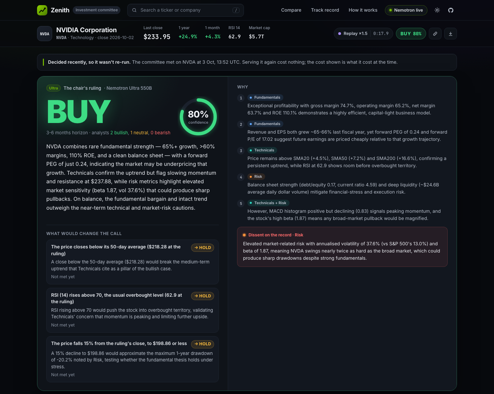
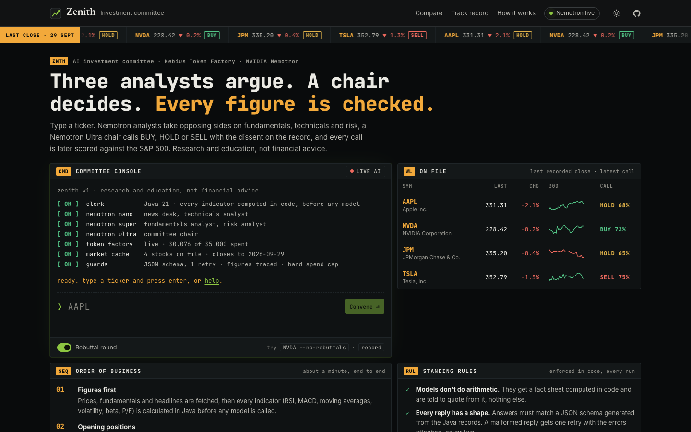
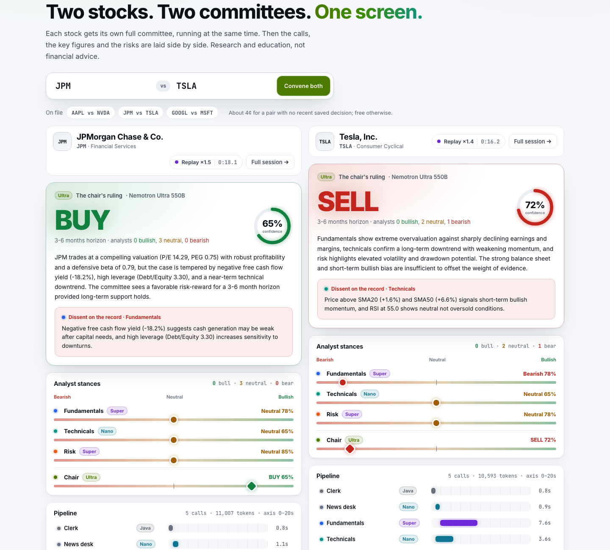
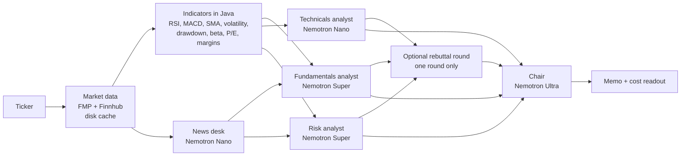

# Zenith: AI Investment Committee

[](https://github.com/samaunmahmud/zenith/actions/workflows/ci.yml) [](LICENSE)

Type a stock ticker. Three AI analysts (**Fundamentals**, **Technicals** and **Risk**) each study the stock and argue a position. A **chair** running **NVIDIA Nemotron Ultra** weighs their arguments, makes a **BUY / HOLD / SELL** call with a confidence level, records the strongest **dissenting view**, and writes an investment memo. Every decision comes with a **cost readout**: tokens, latency and dollars, broken down by model.

Beyond a single decision:

- **Track record.** Every decision is recorded with its price and scored against the S&P 500 at 7, 30 and 90 days: BUY is right if the stock beat SPY, SELL if it trailed, HOLD if it stayed within 5 points. Calls stay pending until their window closes; nothing is backfilled. See `/?page=record`.
  The record is kept locally in `cache/_track-record.json` (like the rest of the cache, it isn't committed).
- **What would change the call.** The chair names two or three conditions that would change its decision, and what the call would become (for example "The price closes above its 200-day average ($394.69 at the ruling) → HOLD"). It picks them from a menu of price conditions that code builds, with fixed thresholds, so the chair never invents a number and every condition can be checked.
- **Since this ruling.** A saved decision says how it has aged: the stock and the S&P 500 since the close the committee saw, whether the call is on track so far, the technical figures then and now, and which of the chair's conditions have been met. It's arithmetic on daily closes, with no model call.
- **Test your thesis.** Write your own case for or against the stock. The chair (Nemotron Ultra) cross-examines each claim against the analysts' fact sheets, marks it supported, contradicted or unverifiable, argues the strongest case against you, and writes a Counter-Thesis Memo. About 1¢.
- **Head to head.** Put two stocks on trial: two full committees sit in parallel, then the calls, key figures and risks are laid side by side. See `/?page=compare&a=NVDA&b=AMD`.

Built for the **Nebius x NVIDIA Global AI Hackathon** (Best Apps and Agents track), running on **Nebius Token Factory** with the **NVIDIA Nemotron** family (Nano, Super and Ultra).

> ⚠️ **Research and education tool only. Not financial advice.** The analysts are language models and can be wrong. Market data may be delayed or incomplete.

**Live demo:** _coming soon_ · **Demo video:** _coming soon_



<details>
<summary>The landing console, and head to head in the light theme</summary>





</details>

---

## Why

Real investment committees don't trust one opinion. They make specialists argue, and they write down who disagreed. Zenith copies that structure with agents. The goal is not to "predict the market". It's to show a transparent, auditable way to combine several AI viewpoints, where you can see exactly which argument drove the decision, what it cost and where every number came from.

## How it works



1. **Data.** Daily prices (about 1 year), fundamentals and recent headlines are fetched and cached on disk.
2. **Indicators.** Every number is **calculated in Java**, not by a model: returns, SMA20/50/200, RSI(14), MACD, 52-week range, annualised volatility, max drawdown, beta vs SPY, liquidity and valuation ratios. These are formatted once into a fact sheet for each analyst.
3. **News desk (Nano)** condenses the headlines into themes and events.
4. **Three analysts run in parallel** (Java virtual threads). Each has its own personality and remit, and returns strict JSON: stance, confidence, key points, evidence and concerns.
5. **Rebuttal round (optional).** Each analyst gets exactly one short reply to a colleague. There are no open-ended debate loops.
6. **The chair (Ultra)** decides. It must name the analyst behind each part of its reasoning, record the strongest dissent, and pick the conditions that would change its call from a menu computed in code.
7. **Memo.** The memo is assembled **in code** from the structured outputs, so its tables and disclaimer can't be hallucinated. You can download it as Markdown.

The session screen leads with the verdict. While the committee works, a progress banner shows each stage; three analyst cards fill in as each report lands (stance, confidence, headline, key points, rebuttal); and a pipeline chart draws every Nemotron call on one time axis, coloured by tier, with its time, tokens and cost. Then the chair's ruling lands with its confidence, the reasons (each tagged with the analyst it came from) and the dissent. Live runs stream over Server-Sent Events; a saved session is replayed from its recorded per-call timings, labelled as a replay.

8. **Ask the committee.** After the ruling, visitors can question the session in a chat. The secretary (Super) answers only from that session's figures, reports and ruling; cited figures are checked like the analysts' evidence (an invented value is sent back for one retry), and any figure in the prose that isn't in the session is flagged on the page.

## How the Nemotron models are used

| Agent | Model | Why this size |
|---|---|---|
| News desk | **Nemotron Nano** (`nvidia/NVIDIA-Nemotron-3-Nano-30B-A3B`) | Summarising headlines into themes is simple, high-volume work. |
| Technicals analyst | **Nemotron Nano** | Reading well-defined indicators (RSI, MACD, moving averages) is a narrow task, so the fast, cheap model is enough. |
| Fundamentals analyst | **Nemotron Super** (`nvidia/nemotron-3-super-120b-a12b`) | Weighing valuation against growth, margins and leverage needs mid-weight reasoning. |
| Risk analyst | **Nemotron Super** | Combining volatility, drawdown, beta, leverage and news risk into one view. |
| Chair | **Nemotron Ultra** (`nvidia/Nemotron-3-Ultra-550b-a55b`) | The final judgement weighs conflicting arguments and records the dissent, so it gets the strongest reasoning model. |
| Secretary ("Ask the committee") | **Nemotron Super** | Answers follow-up questions about a finished session from its fact sheets, reports and ruling. It explains a decision already made, so it needs clear reasoning over evidence, not Ultra's final judgement. About 0.3¢ a question. |

The principle is to **spend reasoning where it matters**. Most calls go to Nano and Super, and there is exactly one Ultra call per decision. The in-app cost readout shows this split for every run, and compares it with what the same calls (same tokens) would have cost on Ultra alone. The session's **pipeline chart** draws every call on one time axis, coloured by tier, with its measured latency, tokens and cost. Model IDs are set in `.env`, so you can swap tiers without changing code.

### Guardrails around the models

- **LLMs interpret, code calculates.** Agents only see pre-computed figures and are told never to invent numbers.
- **Structured output.** Each agent's JSON schema is generated from its Java record and sent using Token Factory's `json_schema` response format (it falls back to `json_object` if a model rejects it).
- **Validate and retry once.** Every reply is checked with Bean Validation plus agent-specific rules. If a check fails, the errors are fed back to the model for **one** retry. If it fails again, the UI shows a clean error instead of crashing, and the chair decides on the reports that did arrive.
- **Number tracing.** Every figure an analyst cites as evidence must match (allowing for rounding) a figure in its input, or the reply is rejected and retried. Free text is also scanned, and any number that can't be traced is flagged in the UI.
- **Checkable triggers.** The chair's "what would change the call" list must use ids from a menu of price conditions built in Java (crossing the 50 or 200-day average, RSI above 70 or below 30, a 15% move, 10 points against the S&P 500, a new 52-week high or low). An unknown id, a duplicate, or a "change" to the same call is sent back for a retry. Because every condition is price-based, code checks it against each new close.

## Where Token Factory accelerated the work

- **One OpenAI-compatible API for three model sizes.** Switching an agent from Nano to Super to Ultra is a one-word change (the model ID). That made it quick to test which tier each role actually needs.
- **No infrastructure to run.** No GPUs to provision and no model servers to operate. The backend makes a plain HTTPS `POST /v1/chat/completions` using Java's built-in `HttpClient`, with no vendor SDK.
- **Structured output built in.** `response_format: json_schema` constrains the models to our schemas, so most validation work happens before a reply even reaches our code.
- **Per-token pricing** makes the per-decision cost readout straightforward: tokens × list price, per call. The same numbers drive a hard spending cap.

## Other Nebius services

- **Nebius Serverless AI Endpoints** host the app: one container serving the React frontend and the Spring Boot API. See [Deploying to Nebius](#deploying-to-nebius).
- **Nebius Container Registry** holds the image, and **SecretStash (MysteryBox)** holds the API keys the endpoint reads.

## Tech stack

- **Backend:** Java 21, Spring Boot 4, Jackson 3, Bean Validation, JUnit 5. Parallel agents run on **virtual threads**, and progress streams over **SSE**.
- **Frontend:** React 18, TypeScript, Vite and plain CSS, with no UI framework.
- **LLMs:** NVIDIA Nemotron Nano / Super / Ultra via Nebius Token Factory.
- **Market data:** [Financial Modeling Prep](https://site.financialmodelingprep.com) for prices and fundamentals, and [Finnhub](https://finnhub.io) for news. Both free tiers are enough. Alpha Vantage's free tier was ruled out because it only returns 100 days of prices, which isn't enough for SMA200 or a 1-year view.
- **Storage:** none beyond a JSON disk cache. No database, no auth.

## Setup

**Prerequisites:** Java 21+, Maven 3.9+ and Node.js 20+.

```bash
git clone https://github.com/samaunmahmud/zenith.git
cd zenith
npm install
cp .env.example .env    # then fill in the keys below
```

| Key | Where to get it | Required |
|---|---|---|
| `TOKEN_FACTORY_API_KEY` | [tokenfactory.nebius.com](https://tokenfactory.nebius.com) | yes |
| `FMP_API_KEY` | [Financial Modeling Prep](https://site.financialmodelingprep.com) (free) | yes |
| `FINNHUB_API_KEY` | [Finnhub](https://finnhub.io) (free) | optional: news headlines |

The Token Factory base URL and Nemotron model IDs are already filled in `.env.example`.

**Spending cap.** `MAX_SPEND_USD` is a hard cap on total Token Factory spend. The running total is kept in `cache/_spend.json`, so it survives restarts, and model calls are refused once the cap is reached. It defaults to `0`, which switches AI calls off, so a missing variable can never spend money: set it explicitly (for example `0.20`) wherever live committee runs should be allowed. This protects both a small credit balance and a public demo URL.

**Budget protection for a public URL.** The cap limits the total; a small gate in front of the committee spreads it out, so one burst of visitors can't spend it all in minutes:

| Variable | Default | Effect |
|---|---|---|
| `REUSE_HOURS` | `6` | A ticker decided within this window is served again, labelled with its time, at no cost. `0` = always run live. |
| `LIVE_RUNS_PER_HOUR` | `20` | Paid committee runs per rolling hour. `0` = no hourly limit. |
| `MAX_CONCURRENT_RUNS` | `2` | Paid runs allowed at the same time. |
| `SEARCHES_PER_DAY` | `60` | Live company-name searches per rolling day (2 FMP calls each), so typing in the search box can't use up the market data quota the committee needs. After that, the stocks on file are searched. `0` = no limit. |

When a live run isn't allowed or fails, the last saved decision for that ticker is shown instead, and the UI says why.

## Running

```bash
npm run dev          # Spring Boot on :3001 + Vite on :5173 → open http://localhost:5173
npm test             # frontend tests (Vitest) + backend unit and end-to-end tests (JUnit)
npm run smoke        # call Nano, Super and Ultra once each and print tokens, latency, cost
npm run precache     # cache market data for the demo tickers (DEMO_TICKERS in .env)
```

To also save a full committee run per demo ticker, which the app replays if Token Factory is unreachable during a live demo:

```bash
cd backend && mvn -q spring-boot:run -Dspring-boot.run.arguments="--precache --committee"
```

Set `DEMO_MODE=true` in `.env` to serve market data from the cache only, with no market data API calls.

Production build (a single jar that also serves the frontend):

```bash
npm run build && npm start     # http://localhost:3001
```

You can link straight to a run: `/?ticker=NVDA&rebuttals=true`.

## Deploying to Nebius

The Dockerfile builds the frontend, bundles it into the Spring Boot jar, and runs it on a slim JRE image as a non-root user on port 8080. `scripts/deploy-nebius.sh` does the rest with the [Nebius CLI](https://docs.nebius.com/cli):

```bash
npm run precache                 # bake demo data into the image
scripts/deploy-nebius.sh         # registry → image → secrets → public endpoint → URL
```

It takes these steps:

1. Creates (or reuses) a **Nebius Container Registry** called `zenith`, builds the image for `linux/amd64`, tags it with the commit, and pushes it.
2. Stores `TOKEN_FACTORY_API_KEY`, `FMP_API_KEY` and `FINNHUB_API_KEY` from `.env` in a **SecretStash (MysteryBox)** secret called `zenith-keys`. The endpoint reads them with `--env-secret KEY=zenith-keys`, so the keys never appear on a command line or in the image.
3. Creates a public **Serverless AI endpoint** on a CPU platform (`cpu-d3`, `4vcpu-16gb`; the CLI's default is a GPU, which this app doesn't need). The public-demo settings go in as plain `--env` values: `MAX_SPEND_USD`, `REUSE_HOURS=1000`, `LIVE_RUNS_PER_HOUR=10`, `SEARCHES_PER_DAY=60`.
4. Waits for the HTTPS URL to answer `/api/health` and prints it.

Things that matter more on a public URL than locally:

- **`MAX_SPEND_USD` counts what's already been spent.** The image copies `cache/` as it is, including `cache/_spend.json`, so the endpoint starts with your local spend counted. Set the cap above that total (`PUBLIC_SPEND_USD`, default `3.00`), or AI calls start switched off; the script checks this before building. The ledger is only as durable as the container's disk: if the endpoint restarts on fresh storage, it goes back to the value baked into the image, so the cap limits spend per container lifetime, not in total.
- **`REUSE_HOURS`** decides how long a saved decision is served instead of a new paid run. The default is 6 hours, so without it every visitor who clicks a demo ticker after that window starts a live committee.
- **Don't set `DEMO_MODE`.** It stops price updates, and "Since this ruling" and the chair's watch list are checked against new closes.
- **Don't pass `PORT`.** The image sets `PORT=8080` to match `--container-port`. To test the image locally with your `.env`, add `-e PORT=8080` after `--env-file .env`; an explicit `-e` wins.

See the [Serverless AI endpoints docs](https://docs.nebius.com/serverless/endpoints/manage) for platform and secret options.

## API

| Method | Path | Description |
|---|---|---|
| `GET` | `/api/health` | Status and which keys are configured |
| `GET` | `/api/config` | Demo tickers and the agent → model roster |
| `POST` | `/api/committee` | `{ "ticker": "AAPL", "rebuttals": false }` → full result as JSON |
| `GET` | `/api/committee/stream?ticker=AAPL&rebuttals=true` | The same run as Server-Sent Events (`stage`, `snapshot`, `news`, `report`, `analystError`, `rebuttal`, `decision`, `done`, `error`) |
| `POST` | `/api/thesis` | `{ "ticker": "NVDA", "thesis": "..." }` → the chair cross-examines the thesis against the latest session on that stock (one Nemotron Ultra call) and returns the review and a Counter-Thesis Memo |
| `POST` | `/api/ask` | `{ "ticker": "NVDA", "question": "...", "history": [] }` → the secretary (one Nemotron Super call) answers from the latest session on that stock, with the figures it relied on |
| `GET` | `/api/track-record` | Every recorded decision, scored against SPY at 7, 30 and 90 days, with a win rate per window |
| `GET` | `/api/since?ticker=TSLA` | How the latest saved decision has aged: stock and SPY return since, on track or not, figures then and now, and the chair's watch list checked against every close since. `204` if there's no saved decision |
| `GET` | `/api/search?q=sandisk` | US-listed stocks matching a ticker or company name, for the search suggestions |
| `GET` | `/api/tape` | Last recorded close, daily change and latest call for each stock on file (cache only) |

## Project structure

```
backend/src/main/java/com/zenith/
├── api/          REST + SSE controller
├── committee/    orchestrator, budget gate, result and event types
├── agents/       analysts, news desk, rebuttal, chair, secretary, devil's advocate, number checker
├── llm/          Token Factory client, JSON schema generation, cost tracking, spending cap
├── data/         FMP + Finnhub clients, symbol search, disk cache
├── indicators/   pure indicator functions and the snapshot builder
├── schema/       agent output records (validated)
├── memo/         Markdown memo builder
├── ask/          "Ask the committee" follow-up questions
├── thesis/       thesis review and Counter-Thesis Memo
├── track/        decision ledger, scoring against SPY, and how a saved ruling has aged
├── tape/         the landing page's stocks on file
└── cli/          --smoke and --precache tasks
backend/src/main/resources/prompts/   one Markdown system prompt per agent

frontend/src/
├── state/        committee reducer (pure, unit-tested)
├── hooks/        SSE session + URL sync, replay playback, search suggestions, AI status, theme
├── lib/          session timeline, figure tracing, formatting, glossary
├── components/
│   ├── session/    verdict, analyst cards, pipeline chart, cost meter, ask panel, integrity and fact panels
│   ├── landing/    hero search, committee diagram, stocks on file
│   ├── compare/    head to head
│   ├── record/     track record
│   ├── committee/  memo and the per-call cost table
│   ├── workspace/  run notices, thesis review
│   ├── market/     price chart
│   ├── layout/     top bar, footer
│   └── ui/         cards, tabs, icons, suggestion list
└── styles/       tokens, base, layout, components, app
```

## Limitations

- Fundamentals come from free-tier data: there's no forward P/E, and some fields may be missing for some tickers. Agents are told when data is missing instead of guessing.
- The number tracer catches invented figures, not wrong reasoning. The analysts can still misread correct numbers.
- US tickers only (free data plans).

## License

MIT. See [LICENSE](LICENSE).
